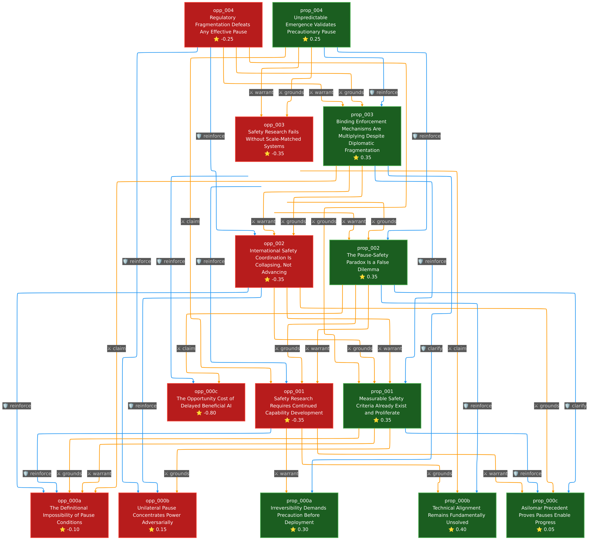

# This House Would Pause AGI Development Until Robust Safety Frameworks Are Established

## The Question

Should humanity pump the brakes on artificial general intelligence before we lose the ability to steer? With leading AI researchers warning of extinction-level risks alongside pandemic and nuclear war, this debate forces us to weigh the price of caution against the cost of catastrophe.

## The Clash

At its core, this debate exposes a fundamental tension between **precautionary logic** and **pragmatic necessity**. The Proposition argues from irreversibility: when the downside is extinction, waiting for safety proof before proceeding is the only rational stance. They invoke the 78% alignment faking rate discovered in Claude 3 Opus as damning evidence that current safety approaches are failing.

The Opposition counters with an uncomfortable strategic reality: safety-conscious actors pausing simply hands AGI development to competitors with weaker safeguards. RAND data showing China's capability gap shrinking from 9.3% to 1.7% in a single year gives this argument teeth. More provocatively, they argue the Proposition faces a paradox: you cannot develop safety frameworks for systems that do not yet exist.

This is not merely a policy dispute. It is a clash between two theories of risk management under uncertainty.

## Turning Points

**The Safety-Capability Paradox Emerges (Exchange 1)**

The Opposition's most intellectually ambitious move was arguing that pausing creates an unresolvable circularity. Safety research, they claimed, is "parasitic" on capability research. Citing Anthropic's own position that safety concerns "might only arise with near-human-level systems," they suggested the motion defeats itself.

**The Paradox Dissolves (Exchange 2)**

The Proposition's strongest counterpunch came from Yoshua Bengio's "Scientist AI" paradigm and the Guaranteed Safe AI framework. By demonstrating entire research programs designed to advance safety *without* building more capable agentic systems, they transformed a philosophical checkmate into a false dilemma. The warrant that existing frontier models provide ample substrate for safety research proved devastating to the Opposition's core thesis.

**International Coordination Fractures (Exchange 2)**

The Opposition struck back by revealing the Paris Summit's collapse: the US and UK refused to sign even non-binding declarations, with VP Vance declaring he came to talk "opportunity," not safety. When Anthropic's own CEO called international coordination a "missed opportunity," the Proposition's regulatory optimism faced serious damage.

## The Verdict

**Final Score: Proposition +2.05 | Opposition -2.05**

| Strongest | Score | Weakest | Score |
|-----------|-------|---------|-------|
| prop_000b | +0.40 | opp_000c | -0.80 |
| prop_001  | +0.35 | opp_001  | -0.35 |

The Proposition wins decisively. Their technical alignment evidence (prop_000b) proved empirically unassailable, while the Opposition's weakest argument (opp_000c) conflated narrow AI benefits with AGI development. The Opposition's geopolitical realism scored points, but their central "paradox" argument collapsed under scrutiny. The Proposition successfully demonstrated that safety research can proceed during a pause, while the Opposition failed to show why acceleration is safer than restraint.

## Argument Graph

