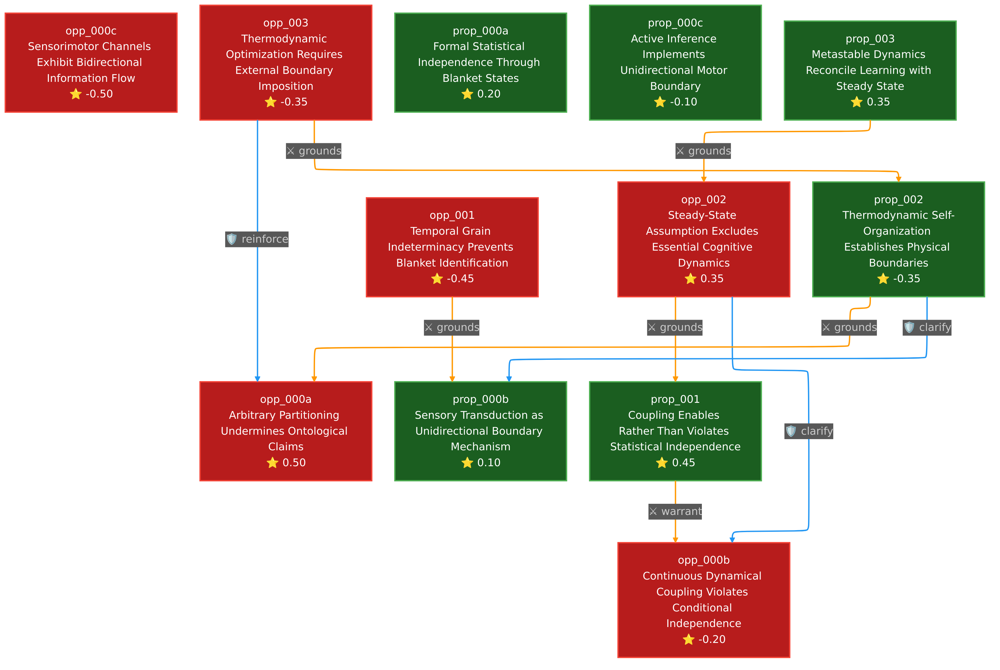

# The Markov Blanket: Statistical Tool or Physical Boundary?

## The Question

Does a Markov blanket of sensory and active channels truly separate brain from environment, or is this mathematical formalism merely a convenient fiction imposed by researchers? This debate strikes at the heart of computational neuroscience's most ambitious claim: that statistical tools can reveal the fundamental architecture of mind-world interaction.

## The Clash

The fundamental disagreement centers on whether Markov blankets represent **discovered boundaries** or **stipulated partitions**. The proposition grounds their case in rigorous formalism, arguing that sparse coupling in high-dimensional neural systems mathematically generates conditional independence at nonequilibrium steady state. Sensory transduction's thermodynamic irreversibility and motor prediction architectures instantiate this formal structure physically. The opposition counters with a devastating philosophical distinction: epistemic tools are not ontological entities. They argue that boundaries requiring arbitrary redefinition when grasshoppers move, or control volumes adjusted to suit thermodynamic analysis, cannot claim existence as natural features. The proposition treats statistical properties of probability distributions as revealing physical structure; the opposition insists researchers impose these partitions wherever convenient, confusing the map with the territory.

## Turning Points

**The Steady-State Trap (Exchange 2):** The debate's trajectory shifted dramatically when opposition argument **opp_002** exploited the proposition's steady-state qualifier. By citing Baltieri & Isomura's demonstration that distance from equilibrium prevents Markov blanket structure, combined with evidence that Hebbian plasticity and attention switching operate through fundamentally non-steady-state dynamics, the opposition forced a crisis: if blankets require steady state but cognition requires non-steady dynamics, no blanket exists during actual brain-environment interaction. The proposition had scored well with their coupling-independence distinction in **prop_001**, but their emphasis on "nonequilibrium steady state" created a vulnerability that opposition ruthlessly exploited.

**The Metastability Counterattack (Exchange 3):** Proposition argument **prop_003** mounted a sophisticated rescue operation by introducing metastable dynamics. Citing cutting-edge 2024-2025 neuroscience, they demonstrated that learning and cognition occur *within* metastable nonequilibrium stationary states rather than requiring departure from them. This reframed the entire debate: steady state doesn't mean static equilibrium but stable probability distributions permitting functional flexibility. The attack exposed opposition's conflation of these concepts, showing that neural systems maintain conditional independence during cognitive function by operating in metastable regimes where synaptic plasticity coexists with sustained statistical structure.

## The Verdict

**Final Scores (Zero-Sum):** Proposition +0.65, Opposition -0.65

**Strongest Arguments:**
- **opp_000a** (+0.5): The devastating ontological critique distinguishing epistemic tools from physical entities, supported by peer-reviewed philosophical analysis
- **prop_001** (+0.45): Rigorous clarification that dynamical coupling generates rather than violates conditional independence at steady state
- **prop_003** (+0.35): Strategic dissolution of the steady-state objection through metastability framework

**Weakest Arguments:**
- **opp_000c** (-0.5): Fundamental misunderstanding of Markov blanket formalism regarding bidirectionality
- **opp_001** (-0.45): Temporal scaling argument with incomplete logical chain
- **opp_003** (-0.35): Methodological critique that proved strategically tangential

The proposition prevails through technical sophistication and strategic evolution. While the opposition landed a powerful philosophical opening blow exposing the map-territory confusion, they failed to maintain momentum. The proposition's metastability framework effectively neutralized the steady-state objection, demonstrating that cognitive dynamics operate within rather than beyond the conditions supporting conditional independence. The debate ultimately turned on whether mathematical formalisms describe or prescribe neural architecture, with the proposition successfully arguing that nonequilibrium stationary states constitute discovered rather than stipulated boundaries.

## Argument Graph

