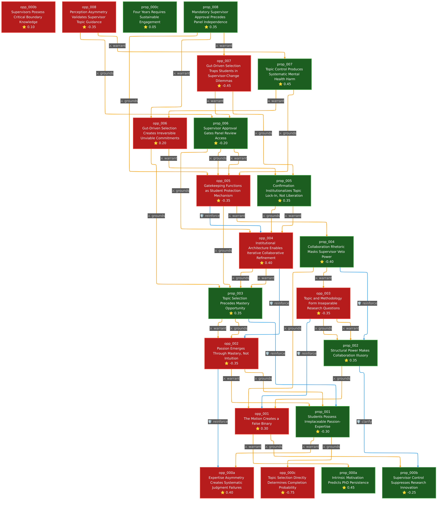

# PhD Research Autonomy: Following Your Gut vs. Following Your Supervisor

## The Question

When Australian PhD students choose what they'll research for four years, should they trust their own instincts or defer to their supervisor's expertise? The stakes are stark: 85% of Australian PhD students fail to complete their degrees, and this debate explores whether that crisis stems from students ignoring expert guidance or from supervisors crushing the autonomous motivation essential for persistence.

## The Clash

At its core, this debate pits two fundamentally incompatible theories of how knowledge and motivation interact. The proposition grounds its case in **self-determination theory**, arguing that autonomous motivation driven by personal passion creates the psychological resilience required to persist through a four-year doctoral journey. Their evidence shows students with high self-determined motivation demonstrate dramatically lower dropout intentions, while controlled motivation from external pressures produces attrition and psychological harm.

The opposition counters with the **Dunning-Kruger effect**, arguing that novices systematically overestimate their ability to assess research viability. Beginning PhD students lack the metacognitive capacity to recognize what they don't know, making their gut feelings about topic feasibility dangerously unreliable. Without domain expertise to identify genuine research frontiers or assess scope appropriately, student intuition produces systematically flawed judgments that lead to unviable projects and catastrophic failure.

This creates an intellectual standoff: Is completion primarily a motivational problem requiring autonomous topic choice, or a judgment problem requiring expert guidance?

## Turning Points

**Exchange 4: The Institutional Architecture Gambit**

The opposition's most significant strategic innovation came with **opp_004**, which reframed the entire temporal structure of the debate. Rather than accepting the proposition's framing of topic selection as a single application-stage decision, the opposition leveraged Australian PhD confirmation processes occurring 6-12 months post-enrollment. This argument demonstrated that application proposals are preliminary starting points that undergo systematic refinement through supervisor collaboration and independent panel review. The evidence was devastating: universities explicitly state research "is likely to evolve" and initial proposals function "more as entrance exam than something you will really pursue." This dissolved the proposition's temporal paradox, suggesting students need not choose final topics prematurely but can begin with gut-driven interests that expert guidance transforms into viable questions.

**Exchange 5-6: The Lock-In Counter-Strike**

The proposition fought back with **prop_005** and **prop_006**, introducing substantial evidence on institutional barriers that undermine confirmation flexibility. Visa implications for international students, funding constraints tied to initial proposals, supervisor approval requirements preceding panel review, and sunk cost psychology all demonstrated that confirmation processes provide far less genuine flexibility than opposition claimed. The procedural evidence in prop_006 was particularly strong: supervisor gatekeeping occurs *before* panel review at multiple Australian universities, systematically undermining the independence the opposition relied upon.

**Exchange 7: The Mental Health Crisis**

The debate's most dramatic turning point came with **prop_007**, which pivoted to psychological wellbeing with devastating quantitative evidence. Research on 302 Australian PhD students revealed 45% suffered moderate to severe depression, 39% moderate to severe anxiety, and 36% were at suicide risk. Supervisor relationship quality emerged as a significant predictor of mental health outcomes, while structural equation modeling demonstrated that autonomy-supportive teaching protects against depression while controlling approaches create autonomy frustration producing demotivation. This reframed supervisor gatekeeping not as protection against failure but as *causing* the mental health crisis driving attrition. The opposition's **opp_007** response relied on weak evidence (blog posts and Medium articles) and could not match the proposition's peer-reviewed quantitative rigor.

## The Verdict

**Final Scores:** Proposition +1.2, Opposition -1.2

**Strongest Arguments:**
- **prop_000a** (+0.45) and **prop_007** (+0.45): The combination of self-determination theory with quantitative mental health evidence created the proposition's strongest offensive, demonstrating both the motivational necessity and psychological risks of the competing approaches.
- **opp_000a** (+0.4) and **opp_004** (+0.4): The Dunning-Kruger framework and institutional architecture argument represented the opposition's best strategic positioning, though ultimately insufficient against the mental health evidence.

**Weakest Arguments:**
- **opp_000c** (-0.75): Fatally circular reasoning about completion data
- **opp_007** (-0.45): Weak evidence base relying on blogs rather than peer-reviewed research

**Assessment:** The proposition won through superior evidence quality and strategic pivoting. While the opposition's expertise asymmetry argument had genuine force, they never adequately addressed how supervisor gatekeeping could protect completion when it systematically damages the autonomous motivation and mental health that determine persistence. The proposition successfully demonstrated that Australian PhD failure is fundamentally a psychological crisis requiring autonomy support, not a judgment problem requiring expert control. The debate ultimately vindicated autonomous topic selection as essential for the motivational resilience required to survive doctoral research.

## Argument Graph

